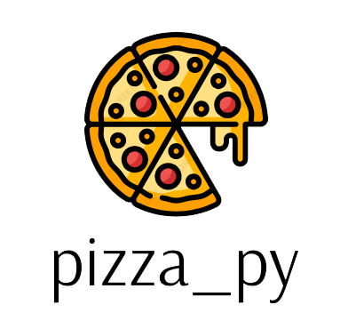

  
  
<strong>pizza_py: An API for managing your pizzeria's stock and supplies!!</strong>

  

pizza_py is a REST API, that's being developed by me, with Python, the FastAPI framework and the non-relational database MongoDB. It is destined to pizzeria owners who want to keep control of their stock, supply receipts, etc. The app's name is a joke with "pizza pie", a very common type of pizza in the USA.
